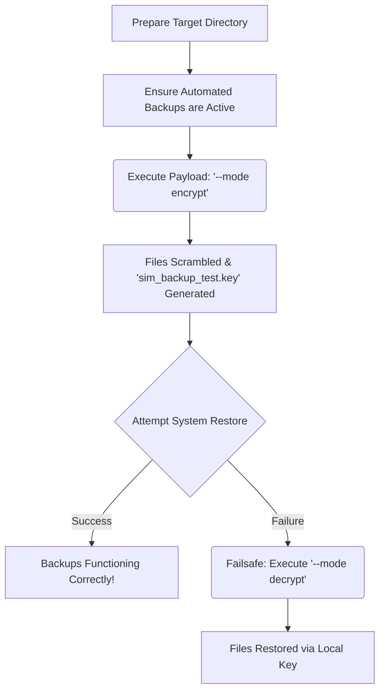

<div align="center">

# 💀 RANSOMWARE BACKUP SIMULATOR 💀

```text
    ██████╗  █████╗ ███╗   ██╗███████╗ ██████╗ ███╗   ███╗
    ██╔══██╗██╔══██╗████╗  ██║██╔════╝██╔═══██╗████╗ ████║
    ██████╔╝███████║██╔██╗ ██║███████╗██║   ██║██╔████╔██║
    ██╔══██╗██╔══██║██║╚██╗██║╚════██║██║   ██║██║╚██╔╝██║
    ██║  ██║██║  ██║██║ ╚████║███████║╚██████╔╝██║ ╚═╝ ██║
    ╚═╝  ╚═╝╚═╝  ╚═╝╚═╝  ╚═══╝╚══════╝ ╚═════╝ ╚═╝     ╚═╝
````

**A rigorous, aesthetically cinematic CLI tool to safely stress-test your system's automated backup and disaster recovery workflows.**

</div>

-----

## 📖 Overview

The **Ransomware Backup Simulator** acts as a controlled "fire drill" for your infrastructure. It utilizes mathematically secure AES encryption to rapidly scramble a designated target directory, allowing you to test if your automated backup solutions can successfully restore data after a critical incident.

> [\!CAUTION]
> **SAFETY RAILS DISABLED IN THIS BUILD**
> The directory name-checking safety mechanism (`dummy`, `sim`, `test`) has been commented out in this specific codebase. This script will execute on **ANY** directory provided in the arguments. Proceed with extreme caution.

> [\!TIP]
> This tool features a stunning, cinematic terminal UI built with `Rich`, complete with progress bars, bouncing spinners, and stylized aesthetic alerts.

-----

## ⚡ Features

  - **Military-Grade Cryptography:** Uses `cryptography.fernet` (AES-128 in CBC mode with a SHA256 HMAC signature).
  - **Cinematic CLI:** Fully stylized terminal output utilizing the `Rich` Python library.
  - **Bi-Directional Simulation:** Includes both an attack payload (`encrypt`) and a recovery failsafe (`decrypt`).
  - **Live Progress Tracking:** Real-time visual metrics for processing massive directories.

-----

## 🗺️ Simulation Workflow

The standard operational procedure for conducting a backup fire drill:



-----

## 🚀 Installation

Ensure you have Python 3 installed, then install the required dependencies:

```bash
# Clone the repository
git clone [https://github.com/yourusername/ransomware-simulator.git](https://github.com/yourusername/ransomware-simulator.git)
cd ransomware-simulator

# Install required packages
pip install cryptography rich
```

-----

## 💻 Usage

> [\!IMPORTANT]
> The encryption key (`sim_backup_test.key`) is generated in the directory where the script is executed. **Do not delete this file** until your backup test is fully resolved, or the files cannot be decrypted via the failsafe.

### 1\. Initiate Attack Simulation (Lock)

```bash
python main.py --target /path/to/your/target_folder --mode encrypt
```

### 2\. Execute Failsafe (Unlock)

If your backup restoration fails, use the generated key to recover your files:

```bash
python main.py --target /path/to/your/target_folder --mode decrypt
```

<details>
<summary><strong>⚙️ View CLI Arguments</strong></summary>

| Argument | Short | Required | Description |
| :--- | :--- | :---: | :--- |
| `--target` | `-t` | ✅ | The absolute or relative path to the directory you wish to process. |
| `--mode`   | `-m` | ✅ | The operational state. Accepts either `encrypt` or `decrypt`. |

</details>

-----

## 🛡️ Disclaimer

> [\!WARNING]
> **Educational & Authorized Testing Only**
> This software is provided for educational purposes and authorized infrastructure stress-testing only. The developers assume no liability and are not responsible for any misuse or data loss caused by this tool. Always test in isolated environments.

<div align="center">
<i>Built for the rigid conditions.</i>
</div>
